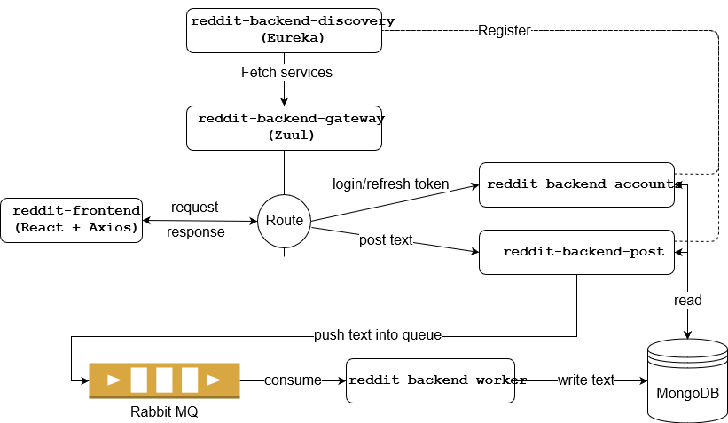

# Simulate Simple Reddit with Miroservice architecture

This project is created to get experience in microservice architecture with Spring Cloud. This is a simple website such as Reddit sharing contents by posting text. The architecture is designed by separating front-end and back-end service and use message queue for scalability. The front-end is implemented by javascript framework React ,and the back-end service consists of many microservices which are responsible for different purpose.

Regarding authentication security, I leverage JWT(Json Web Token) between front-end and back-end as well as implement automatic refresh token mechanism by two type tokens (access token and refresh token).



<b>Structrue</b> : <br>
<b>reddit-frontend</b> represents UI presentation layer.<br>
<b>reddit-backend-master</b> is a gradle root project.<br>
<b>reddit-backend-commons</b> is a sharing library for all projects.<br>
<b>reddit-backend-discovery</b> is a discovery server for other microservices registration.<br>
<b>reddit-backend-gateway</b> is an edge service that provides dynamic routing, security, and more.<br>
<b>reddit-backend-accounts</b> is a microservice for authentication<br>
<b>reddit-backend-post</b> is a microservice handling with request and response of posting context.<br>
<b>reddit-backend-worker</b> is responsible for creating a post which received from reddit-backend-post by message queue.<br>


## Tech Stack
Front-End : ReactJS, Bootstrap, axios, axios-auth-refresh, npm<br>
Back-End : Spring Boot, Spring Cloud(Eureka, Zuul), JPA, JWT(JSON Web Tokens)<br>
DB : MongoDB<br>
Message Queue Broker : RabbitMQ<br>

## Test Enviroment
lauch a MongoDB container.
``` bash
docker run --name my-mongo -p 27017:27017 -d mongo
```

lauch a RabbitMQ container
``` bash
docker run -d --hostname my-rabbit --name my-rabbit -p 15672:15672 -p 5672:5672 rabbitmq:3-management
```
start all back-end microservices
``` bash
cd reddit-backend-discovery
gradle bootRun
```
``` bash
cd reddit-backend-gateway
gradle bootRun
```
``` bash
cd reddit-backend-accounts
gradle bootRun
```
``` bash
cd reddit-backend-post
gradle bootRun
```
``` bash
cd reddit-backend-worker
gradle bootRun
```
note : We can lauch many reddit-backend-post and reddit-backend-worker services for high-throughput request

To start Front-End
``` bash
cd reddit-frontend
npm init
npm start
```
note : only execute <b>npm init</b> for the first time. 

Open [http://localhost:3000](http://localhost:3000) to view it in the browser.


